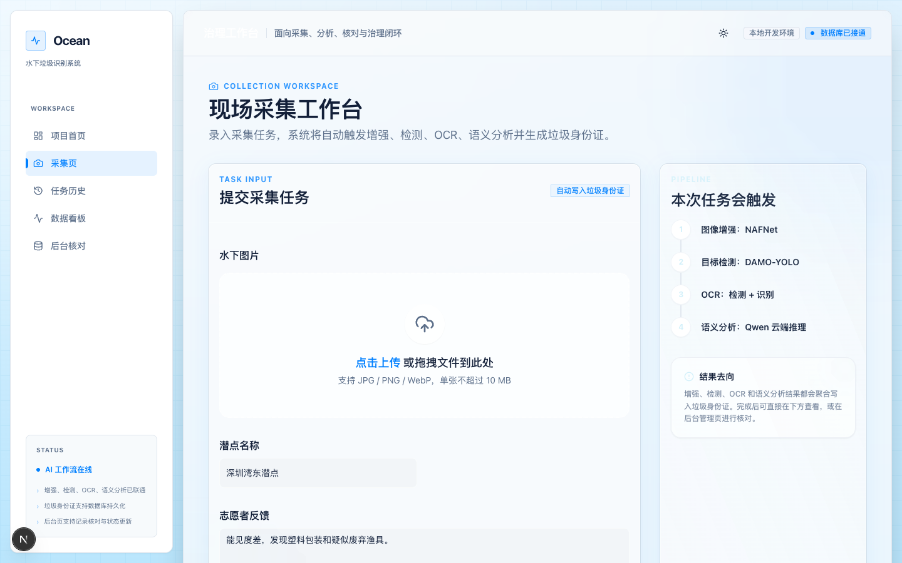
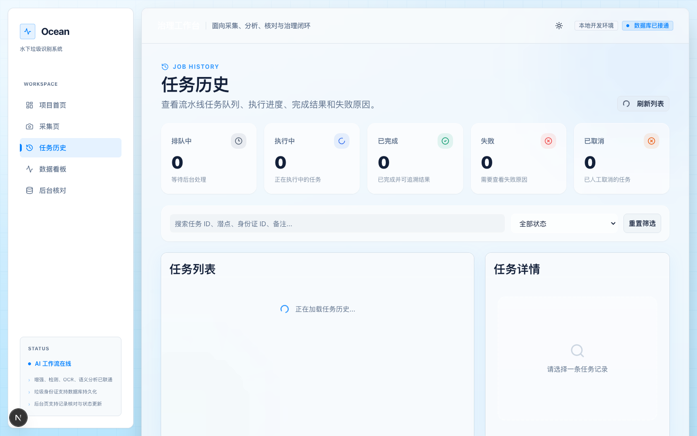
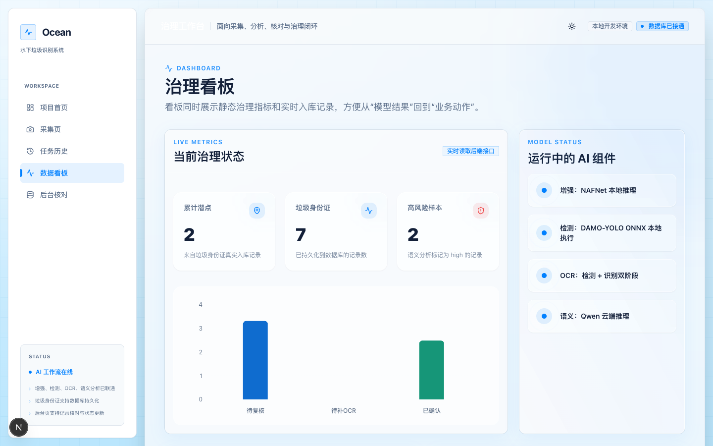
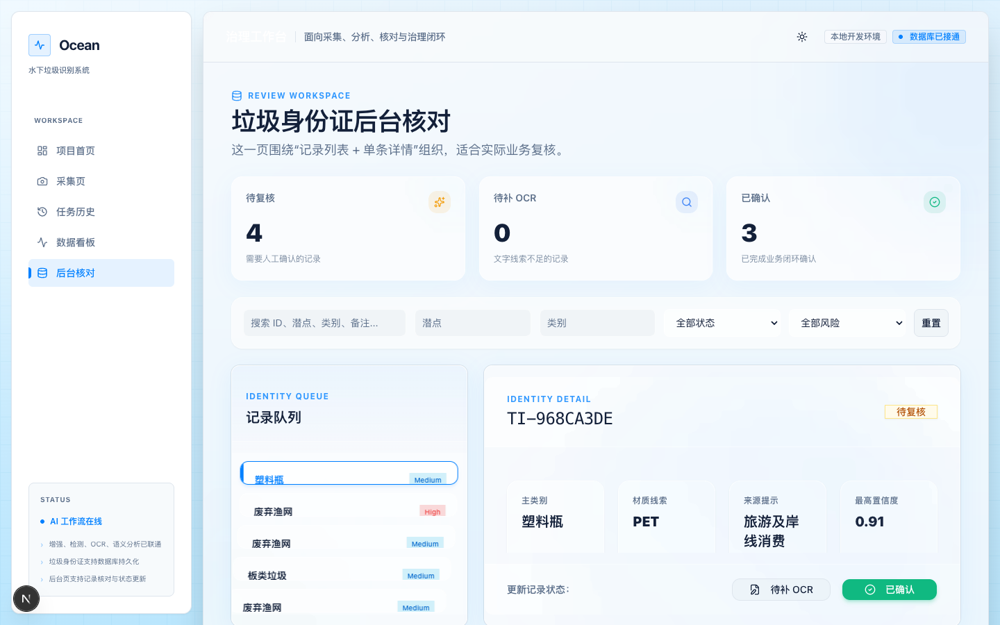
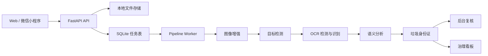

<div align="center">

# Ocean

<p><strong>水下垃圾识别与数据管理 MVP</strong></p>

<p>把一张水下图片，变成一条可追踪、可复核、可统计的治理记录。</p>

<p>
  <a href="https://nextjs.org/"></a>
  <a href="https://fastapi.tiangolo.com/"></a>
  <a href="https://www.sqlite.org/"></a>
  
</p>

</div>

<p align="center">
  
</p>

Ocean 面向海洋环保场景，提供从现场采集到后台治理的端到端演示链路：上传水下图片，执行图像增强、目标检测、OCR 与语义分析，生成“垃圾身份证”，再进入人工复核和真实数据看板。

它不是一次性的模型调用 Demo，而是一个带有异步任务、进度追踪、失败处理、结果持久化和治理视图的可运行 MVP。

## 产品闭环

```text
采集图片与潜点备注
          |
          v
异步 AI 流水线: 增强 -> 检测 -> OCR -> 语义分析
          |
          v
生成垃圾身份证并写入 SQLite
          |
          +--> 任务历史: 队列、进度、失败原因、取消、重试
          |
          +--> 后台核对: 修改审核状态、补充文字线索
          |
          +--> 治理看板: 潜点、类别、风险与入库记录聚合
```

### 这个项目解决什么问题

- 水下图片质量不稳定，先通过增强改善后续识别输入。
- AI 处理阶段较长，通过异步任务和 worker 心跳展示任务到底卡在哪一步。
- 通用检测模型对渔网、绳索等水下专用垃圾覆盖有限，通过规则与 mock fallback 保证演示链路可以继续运行。
- 识别结果不止停留在接口响应，而是沉淀为可复核、可查询、可聚合的垃圾身份证。

## 界面预览

| 采集与 AI 流水线 | 任务历史 |
| :---: | :---: |
|  |  |

| 治理看板 | 后台核对 |
| :---: | :---: |
|  |  |

截图来自仓库内的 `output/playwright/`，对应当前 Web 端页面。

## 核心能力

| 模块 | 已实现能力 |
| --- | --- |
| 现场采集 | 上传 `JPG / PNG / WebP`，单张不超过 `10 MB`，填写潜点和志愿者备注 |
| 异步流水线 | 创建 `jobId`，轮询阶段与进度，支持取消、重试、超时和失败原因记录 |
| 视觉分析 | 图像增强、目标检测、OCR 检测与识别，优先使用本地模型执行 |
| 语义分析 | 对备注、类别、OCR 线索进行标签、摘要、风险等级与行动建议抽取 |
| 垃圾身份证 | 统一保存原图、增强图、类别、置信度、OCR、风险、来源提示和审核状态 |
| 后台复核 | 按状态、潜点、类别、风险和关键词筛选，修改审核状态或补充文字线索 |
| 治理看板 | 基于真实垃圾身份证记录聚合潜点、垃圾类别、风险和近期入库情况 |
| 多端联调 | Web 端与原生微信小程序端共享 FastAPI 接口 |

## 技术架构



### 仓库结构

```text
.
├── src/app/                   # Next.js 页面：首页、采集、任务、看板、后台
├── src/components/            # 通用组件与海洋视觉组件
├── src/lib/                   # 前端 API、项目数据与工具
├── services/api/app/          # FastAPI 应用、路由、模型服务与数据访问
├── services/api/scripts/      # API worker 启动脚本
├── wechat-miniprogram/        # 微信小程序端
├── scripts/                   # 小程序联调与本地启动辅助脚本
├── docs/                      # 项目计划、迁移说明与 PPT brief
├── output/playwright/         # Web 页面截图
└── storage/                   # 本地上传文件、增强文件与 SQLite 数据库
```

## 页面入口

| 路径 | 用途 |
| --- | --- |
| `/` | 项目首页与当前治理概览 |
| `/collect` | 上传图片并创建 AI 采集任务 |
| `/jobs` | 查看任务队列、进度、失败原因、取消与重试 |
| `/dashboard` | 查看真实入库数据的治理聚合 |
| `/admin/trash` | 复核垃圾身份证并补充文字线索 |
| `/plan` | 查看项目计划与当前约束 |

## 快速开始

### 1. 安装依赖

```bash
npm install

python3 -m venv .venv
.venv/bin/pip install -r services/api/requirements.txt
```

如果需要在本地运行增强、检测和 OCR 模型，再安装视觉依赖：

```bash
.venv/bin/pip install -r services/api/requirements-vision.txt
```

### 2. 初始化配置

```bash
cp .env.local.example .env.local
cp services/api/.env.example services/api/.env
```

默认配置下：

- Web API 地址为 `http://127.0.0.1:8000`。
- 数据库为 `storage/ocean.db`。
- 图片保存在 `storage/uploads` 与 `storage/enhanced`。
- 模型依赖、推理失败或语义接口不可用时，系统会自动 fallback，仍可联调业务流程。

### 3. 启动 API、worker 和 Web

分别打开三个终端：

```bash
# Terminal 1: API
.venv/bin/uvicorn services.api.app.main:app --reload --app-dir .
```

```bash
# Terminal 2: 异步流水线 worker
.venv/bin/python services/api/scripts/run_pipeline_worker.py
```

```bash
# Terminal 3: Web
npm run dev
```

打开 [http://localhost:3000](http://localhost:3000)。API 文档可访问 [http://127.0.0.1:8000/docs](http://127.0.0.1:8000/docs)。

### 4. 启动微信小程序

使用微信开发者工具导入 `wechat-miniprogram/` 目录。需要真机访问本机 API 时，可在仓库根目录运行：

```bash
scripts/run-wechat-api.sh
scripts/run-wechat-worker.sh
```

相关配置和联调说明见 [`wechat-miniprogram/README.md`](wechat-miniprogram/README.md)。

## API 速览

### 健康、媒体与任务

| 方法 | 路径 | 说明 |
| --- | --- | --- |
| `GET` | `/api/v1/health` | 检查数据库、worker 与队列状态 |
| `POST` | `/api/v1/media/upload` | 上传图片到本地或已配置的对象存储 |
| `POST` | `/api/v1/ai/pipeline` | 创建异步 AI 流水线任务，返回 `202` 与 `jobId` |
| `GET` | `/api/v1/ai/pipeline/{job_id}` | 查询任务状态、阶段、进度和结果 |
| `GET` | `/api/v1/ai/pipeline-jobs` | 分页查询任务历史，支持状态与关键词筛选 |
| `POST` | `/api/v1/ai/pipeline/{job_id}/retry` | 重试失败或已取消的任务 |
| `POST` | `/api/v1/ai/pipeline/{job_id}/cancel` | 取消排队中或执行中的任务 |

### 垃圾身份证与看板

| 方法 | 路径 | 说明 |
| --- | --- | --- |
| `GET` | `/api/v1/trash-identities` | 查询垃圾身份证，支持审核状态、潜点、类别、风险和关键词筛选 |
| `PATCH` | `/api/v1/trash-identities/{identity_id}` | 更新审核状态或补充文字线索 |
| `DELETE` | `/api/v1/trash-identities/{identity_id}` | 删除一条垃圾身份证记录 |
| `GET` | `/api/v1/dashboard/overview` | 获取基于真实记录聚合的治理概览 |
| `POST` | `/api/v1/media/migrate-storage` | 将本地媒体迁移到已配置的 Supabase Storage |

### 最小 API 调用示例

先上传图片，记录响应中的 `storedPath` 与 `publicUrl`：

```bash
curl -X POST http://127.0.0.1:8000/api/v1/media/upload \
  -F "file=@./sample.jpg"
```

再创建流水线任务。将示例中的文件路径和 URL 替换成上传接口的实际返回值：

```bash
curl -X POST http://127.0.0.1:8000/api/v1/ai/pipeline \
  -H 'Content-Type: application/json' \
  -d '{
    "mediaPath": "storage/uploads/<uploaded-file>",
    "mediaUrl": "http://127.0.0.1:8000/storage/uploads/<uploaded-file>",
    "siteName": "深圳湾东潜点",
    "volunteerNote": "能见度较差，发现塑料包装和疑似废弃渔具。"
  }'
```

任务完成前，用返回的 `jobId` 轮询：

```bash
curl http://127.0.0.1:8000/api/v1/ai/pipeline/<jobId>
```

## AI 模型与 fallback

系统会优先尝试真实模型；本地依赖、模型下载、推理或云端接口异常时，按阶段回退到轻量实现，避免演示链路整体中断。

| 阶段 | 首选实现 | fallback |
| --- | --- | --- |
| 图像增强 | `iic/cv_nafnet_image-denoise_sidd` | OpenCV 水下增强，再回退为原图复制 |
| 目标检测 | `CVHub520/damo_yolo_t` + ONNX Runtime | 规则检测与 mock detections |
| OCR | `damo/cv_resnet18_ocr-detection-db-line-level_damo` + `iic/cv_convnextTiny_ocr-recognition-general_damo` | 检测框裁剪识别，再回退为 mock OCR 文本 |
| 语义分析 | ModelScope OpenAI 兼容接口 + `Qwen/Qwen3.5-397B-A17B` | 规则标签、摘要、风险等级和行动建议 |

需要注意：`CVHub520/damo_yolo_t` 基于 COCO 类别，对渔网、绳索、塑料袋等水下专用垃圾覆盖有限；仓库当前真正集成的是单张图片识别和可配置执行后端，不等同于完整的 X-AnyLabeling 平台能力。

## 配置项

常用配置位于 [`services/api/.env.example`](services/api/.env.example)。

| 配置项 | 作用 | 默认值 |
| --- | --- | --- |
| `NEXT_PUBLIC_API_BASE_URL` | Web 端访问 API 的地址 | `http://127.0.0.1:8000` |
| `MODELSCOPE_LLM_API_KEY` | 语义分析接口密钥 | 空，空值时走规则 fallback |
| `MODELSCOPE_ENABLE_SEMANTIC_LLM` | 是否启用语义分析云端接口 | `true` |
| `ONNX_EXECUTION_PROVIDER` | ONNX 执行后端 | `auto` |
| `DATABASE_URL` | 数据库连接 | `sqlite:///storage/ocean.db` |
| `PUBLIC_BASE_URL` | 后端对外生成媒体 URL 的基地址 | `http://127.0.0.1:8000` |
| `PIPELINE_JOB_TIMEOUT_SECONDS` | 单个流水线任务超时时间 | `180` |
| `PIPELINE_CACHE_VERSION` | 任务去重缓存版本 | `v1` |

Supabase 相关变量用于可选的数据库或对象存储迁移；不配置时，项目默认使用本地 SQLite 和本地文件目录。

## 本地校验

```bash
npm run lint
npm run test:run
npm run build

# Python 语法 smoke check
.venv/bin/python -m compileall -q services/api/app
```

这些命令覆盖前端 lint、Vitest、生产构建和后端 Python 语法检查；真实模型推理仍取决于本机依赖、模型缓存、网络和 API key。

## 当前边界

Ocean 是一个可运行的 MVP / demo prototype，当前边界包括：

- 检测模型仍是通用 COCO 类别，水下专用垃圾识别需要后续数据和模型训练。
- worker 是进程内后台任务，不是外部消息队列；进程异常退出时，执行中的任务不会自动恢复。
- SQLite 已用于持久化任务和垃圾身份证，但尚未引入正式数据库迁移体系。
- 当前没有完整的用户认证、细粒度权限、报告导出和生产级审计能力。
- 本地存储适合演示和联调；生产部署应配置对象存储、外部数据库、任务队列和访问控制。

## 后续方向

- 引入更贴合水下场景的专用检测模型与真实样本评估。
- 将进程内 worker 替换为可恢复的外部任务队列。
- 补充报告导出、批量回迁、权限管理与多端协同。
- 完善移动端采集、复核和离线联调体验。

## 相关文档

- [`docs/project-plan.md`](docs/project-plan.md)：项目目标、技术架构与当前约束
- [`docs/ppt-generation-brief.md`](docs/ppt-generation-brief.md)：汇报 / 路演内容说明
- [`docs/supabase-migration.md`](docs/supabase-migration.md)：Supabase 数据库与媒体迁移说明
- [`wechat-miniprogram/README.md`](wechat-miniprogram/README.md)：微信小程序导入与联调说明

## License

当前仓库未声明开源许可证。若要公开发布或允许第三方复用，请先补充明确的 `LICENSE` 文件。
